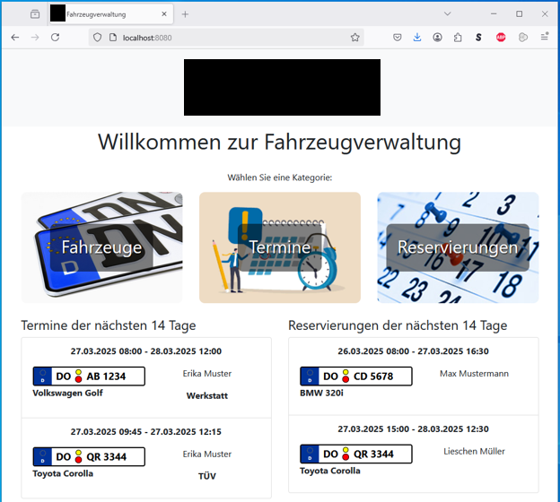
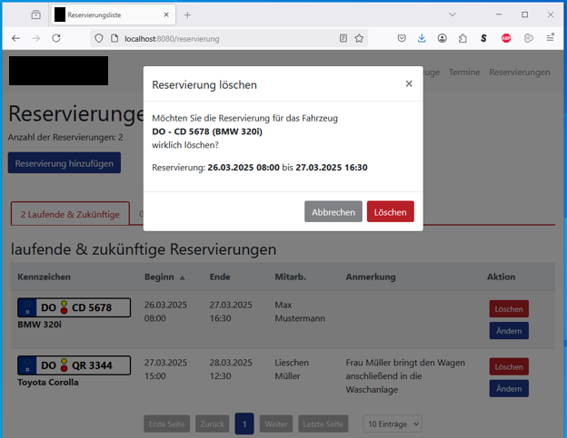
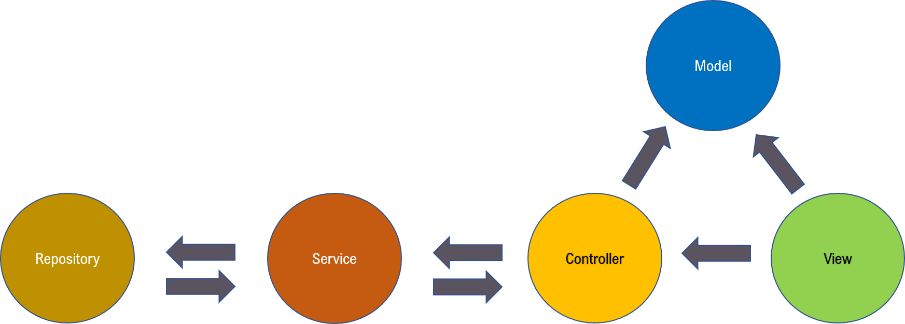
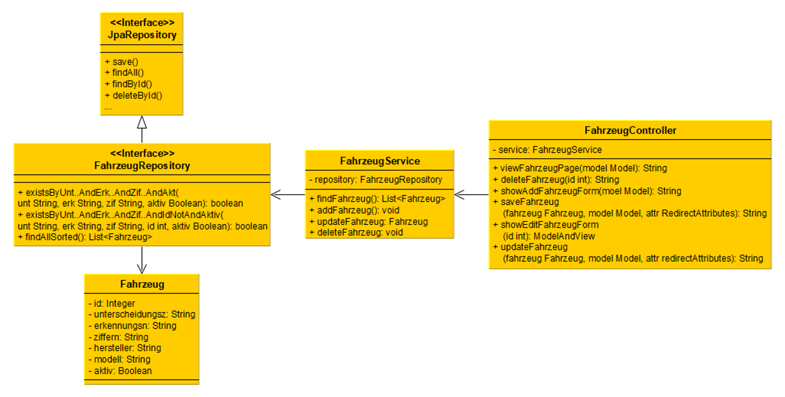

# Webbasierte Fahrzeugverwaltungsanwendung mit Termin- und Reservierungssystem

> **IHK-Abschlussprojekt Showcase** – Fachinformatiker für Anwendungsentwicklung

Dieses Projekt ist eine verfremdete und datenschutzkonforme Version meines praktischen IHK-Abschlussprojekts. Es dient als Showcase für meine Bewerbung und demonstriert meine Fähigkeiten in der Softwareentwicklung mit Java.

---

##  Für Recruiter: Das Projekt auf einen Blick

### Das Problem
Zur Verwaltung des Unternehmensfuhrparks sollte ein neues Konzept entwickelt werden. Der bisherige Prozess führte regelmäßig zu Poblemen wie:
-  Überbuchung von Fahrzeugen,
-  Überschneidungen von Werkstattterminen und Reservierungen,
-  nicht wahrgenommene Termine.

### Die Lösung
Es sollte eine webbasierte Fahrzeugverwaltungssoftware entwickelt werden mit der Möglichkeit, Fahrzeuge, Termine und Reservierungen zu speichern, anzuzeigen, zu ändern und zu löschen.

### Kern-Features
-  **Verhinderung ungültiger Einträge**
-  **Überschneidungsvermeidung zwischen Terminen** 
-  **Überschneidungsvermeidung zwischen Reservierungen**
-  **Priorisierung von Terminen:** Termine können angelegt werden, auch wenn es überschneidende Reservierungen gibt. Reservierungen können nicht angelegt werden, wenn es überschneidende Termine gibt.
-  **Automatische Benachrichtigungen:** Laufende und kommende Termine und Reservierungen der nächsten 14 Tage werden auf der Startseite der Anwendung angezeigt.
                                        Überschneidungen werden angezeigt. 
-  **Responsive Design:** Optimiert für Desktop und mobile Endgeräte.

### Technologie-Stack
- **Frontend:**  HTML, CSS, Javascript, Bootstrap
- **Backend:** Java Spring Boot, Thymeleaf, Hibernate
- **Datenbank:** PostgreSQL
- **Weitere Werkzeuge:** Docker, Git





---

##  Für Entwickler: 

### Architekturmuster
Die Anwendung folgt dem erweiterten MVC-Pattern mit Service und Repository und damit dem für Jakarta EE typischen Architekturmuster. Die Trennung von Geschäftslogik und UI sorgt für hohe Wartbarkeit und Testbarkeit.

### Struktur (Auszug)

### Voraussetzungen
Stellen Sie sicher, dass folgende Software auf Ihrem System installiert ist:
- Java v17+
- PostgreSQL v15+
- Docker & Docker-Compose

### Installation & Setup

1. **Repository klonen:**
   ```bash
   git clone https://github.com
   cd https://github.com/SebastianTre/RecruiterFahrzeug
   ```

2. **Abhängigkeiten installieren:**
   ```bash
   # Für das Frontend/Backend (Anpassen je nach Tech-Stack)
   npm install
   ```

3. **Konfiguration (Umgebungsvariablen):**
   Tragen Sie die Umgebungsvariablen aus der Beispiel-Konfigurationsdatei in Ihrer Entwicklungsumgebung oder in der application.properties-Datei ein.

   *Hinweis: Die echte `.env`-Datei befindet sich in src/main/resources/application.properties.*
   
4. **Datenbank anlegen:** 
   Beim ersten Startvorgang legt Hibernate automatisch die erforderlichen Tabellen in Ihrer Datenbank an.
   Alternativ können sie das beiliegende SQL-Script verwenden. Dieses enthält neben den entsprechenden Tabellen auch Einschränkungen in deren Feldern die eine Validierung der Nutzereingaben auch auf Datenbankebene ermöglichen.

5. **Anwendung lokal starten:**
   ```bash
   npm run dev
   ```
   Die Anwendung ist nun unter `http://localhost:8080` (oder Ihrem spezifischen Port) erreichbar.

---

## Lizenz

Dieses Projekt ist unter der **MIT-Lizenz** lizenziert. Sie können den Code frei einsehen, klonen und modifizieren. Siehe die [LICENSE](LICENSE)-Datei für weitere Details.

## Third-party libraries

Dieses Projekt nutzt die folgenden open-source libraries:

- Bootstrap (MIT License)
- Select2 (MIT License)